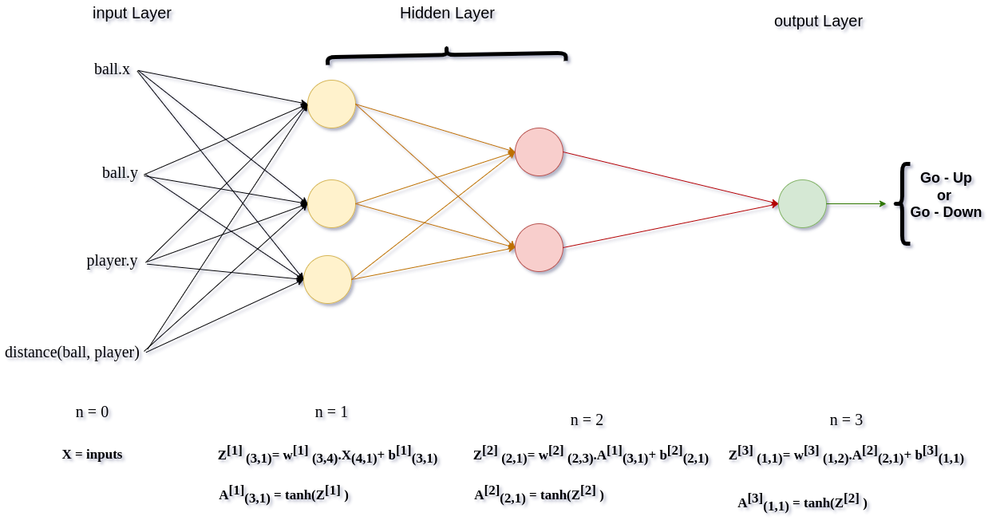
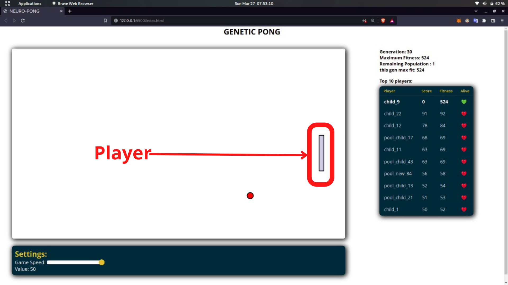

<<<<<<< HEAD
___
# Genetic Pong
This project is a static website which displays the evolving players in the game of ping-pong (also known as table tennis), using **Genetic Algorithm**.
This page is divided into 5 sections arranged in the following order:
- **Genetic Algorithm**
- **Implementation** 
- **The Static Web Page** 
- **Files**
- **Resources**
___
## Genetic Algorithm:
### Introduction:
While computer simulations of evolutionary processes date back to the ***1950s***, much of what we think of as **genetic algorithms** today was developed by **John Holland**, a professor at the University of Michigan, whose book ***Adaptation in Natural and Artificial Systems*** pioneered GA research. Today, more genetic algorithms are part of a wider field of research, often referred to as ***"Evolutionary Computing."*** 
### Infinite Monkey Theorem:

Let’s consider a **monkey** named ***George***. George types on a reduced typewriter containing only twenty-seven characters: twenty-six letters and one space bar. So the probability of George hitting any given key is one in twenty-seven.

Let’s consider the phrase ***“to be or not to be that is the question”*** . The phrase is 39 characters long. If George starts typing, the chance he’ll get the first character right is **1 in 27**. Since the probability he’ll get the second character right is also 1 in 27, he has a 1 in 27*27 chance of landing the first two characters in correct order—which follows directly from our discussion of "event probability" in the Introduction. Therefore, the probability that George will type the full phrase is:

(1/27) multiplied by itself 39 times, i.e. **(1/27)39.**

**Darwinian Natural Selection** is a base for ***Genetic Algorithm*** so let us see about ***natural selection***
### Darwinian Natural Selection:
Before we begin walking through the genetic algorithm, let’s take a moment to describe three core principles of **Darwinian evolution** that will be required as we implement our simulation. In order for natural selection to occur as it does in nature, all three of these elements must be present.

1. **Heredity:** There must be a process in place by which children receive the properties of their parents. If creatures live long enough to reproduce, then their traits are passed down to their children in the next generation of creatures. **Crossover** is the method which does that.

1. **Variation:** There must be a variety of traits present in the population or a means with which to introduce variation. For example, let’s say there is a population of beetles in which all the beetles are exactly the same: same color, same size, same wingspan, same everything. Without any variety in the population, the children will always be identical to the parents and to each other. New combinations of traits can never occur and nothing can evolve. This can be done by **Mutation.**

1. **Selection:** There must be a mechanism by which some members of a population have the opportunity to be parents and pass down their genetic information and some do not. This is typically referred to as “survival of the fittest.” This can be done by using different methods according to the usecase.

By using same theory and implementing it as a code we could simulate ***natural selection***. For more details refer to [Nature of Code By Prof.Daniel Shiffman.](https://natureofcode.com/book/chapter-9-the-evolution-of-code/) 
In the implementation section we will see about how I implement the theory of evolution to automate the ping-pong.

___
## Implementation:
#### Ecosystem
- **Ecosystem** is the senario in which the whole evolutionary process takes place. In the **ping-pong ecosystem.**
- The players who are willing to hit the ball are awarded with one point. 
- The players who are unable to hit the ball are eliminated.
- This process continues until the ball hits the right side of the canvas.
- When the ball hits the right side of the canvas all the remaining players in that particular generation are eliminated as all the players are unable to hit the ball and a **old generation** is replaced by the **new generation** through the process of **selection**.

#### The Brain

I have created a random fancy looking ***neural network*** as shown above which acts as a brain. A **NN** is nothing but a mathematically connected links which contains ***weights** and **biases** responsible for the **thought** of whether to **go - up** or **go - down** according to the inputs given. 4 inputs are provided to the brain. They are:
1. **ball.x:** x-position of the ball.
1. **ball.y:** y-position of the ball.
1. **player.y:** y-position of the player.
1. **dist(ball, player):** distance between the ball and the player.
**Note:** Think about how our brain gets to know when to move up or when to go down in order to hit the ball. Our brain calculates the distance between the ball and the player to hit the ball correctly. Hence I choose these parameterss as inputs. You can experiment with different parameters. 

___
## The Static Web Page:
This static web page has four main components.
- ***Canvas***
- ***Players Information***
- ***Generation Information***
- ***Settings***
### Canvas:

Generally **Canvas** is a place where we draw something. The ***p5.js*** canvas is same as the general canvas. The game gets updated here which gives us the visual representation of the game.

In ping-pong game the main objects are the **ball** and the **player**.

#### Ball:

A **ball** is an object of the class  **`Ball`** with the following ***class variables*** and ***methods***
##### Variables:
##### Methods:
# Fill
#### Player:

A **player** is an object of the class  **`Player`** with the following ***class variables*** and ***methods***
##### Variables:
##### Methods:
# Fill
### Players Information:

 It is a table which represents the information of top 10 players according to their score.
 there are three columns. They are:
 - **name** - represents name of the player.
 - **Score** - represents the score of the player.
 - **Fitness** - represents the fitness of the player.
 - **alive** - represents whether the player is alive or not.

### Generation Information:

 It is a table which represents the information of top 10 players according to their score.
 there are three columns. They are:
 - **name** - represents name of the player.
 - **Score** - represents the score of the player.
 - **Fitness** - represents the fitness of the player.
 - **alive** - represents whether the player is alive or not.
___
## Files:
___
## Resources:
- [The person behind my interest to do this project.](https://shiffman.net/)
- [Nature of Code By Prof.Daniel Shiffman.](https://natureofcode.com/book/)
- [Coding train - YouTube Channel](https://www.youtube.com/channel/UCvjgXvBlbQiydffZU7m1_aw)
=======
# ping-pong
a simple js script to automate ping pong game using genetic algorithm 
>>>>>>> fec4bf65a4bfa6d5ca00a79e91d32a3f6eced3f8
